#### Écrire l’espace. Dynamiques d’imbrication performative de la photographie dans la littérature numérique.
Enrico Agostini-Marchese
 
 
_Université de Montréal_ - _CRC sur les écritures numériques_ 
 
 
« Input pictura poesis »
 
Université Lyon III Jean Moulin
 
 
17 novembre 2017

%%%%%%%%%%%%%%%%%%%%%%%%%%%%%%%%%%%%%%%%%%%%%
<!-- .slide: data-background-image="img/chaire.png" -->

§§§§§§§§§§§§§§§§§§§§§§§§§§§§§§§§§§§§§§§§§§§§§
<!-- .slide: data-background-image="img/richter.jpg" -->
<!-- .element: class="givemeabackground" -->

### Espaces de représentation

__« [...] *les espaces de représentation*, c'est-à-dire l'espace vécu à travers les images et symboles qui l'accompagnent, donc espace des “habitants” et des “usagers”, mais aussi de certains artistes et peut-être de ceux qui *décrivent* et croient seulement décrire : les écrivains, les philosophes. __*C'est l'espace dominé, donc subi*__, que tente de modifier et d'approprier l'imagination. Il recouvre l'espace physique en utilisant symboliquement ses objets »__

 
 
Henri Lefevbre, _La production de l'espace_, p. 49.
§§§§§§§§§§§§§§§§§§§§§§§§§§§§§§§§§§§§§§§§§§§§§
<!-- .slide: data-background-image="img/tendre.jpg" -->
<!-- .element: class="givemeabackground" -->

### Idée de lieu

<small>
__« [...] le lieu […] existe d’abord et avant tout comme un réseau discursif, donc comme une série et une accumulation de discours, qui en détermine et façonne les limites, les constituantes, l’histoire, les paramètres, etc. [...] l’existence discursive du lieu accompagne son existence réelle […] soit sa matérialité, l’expérience vécue de ceux qui l’habitent ou le visitent, etc. Pour tout lieu, on constaterait ainsi une double existence : discursive (ce qu’on en dit) et phénoménologique (ce qu’on en sait par l’expérience) […] Il n’y a pas, a priori, l’une de ces existences qui soit plus importante que l’autre : le lieu existe à la fois par sa matérialité et par son discours. Il n’y a même pas d’antériorité de l’une sur l’autre »__
 
 
Daniel Chartier, « Penser le lieu comme discours » dans _L'idée du lieu_, pp. 15-16.</small>
§§§§§§§§§§§§§§§§§§§§§§§§§§§§§§§§§§§§§§§§§§§§§
<!-- .slide: data-background-image="img/fond_noir.jpeg" -->
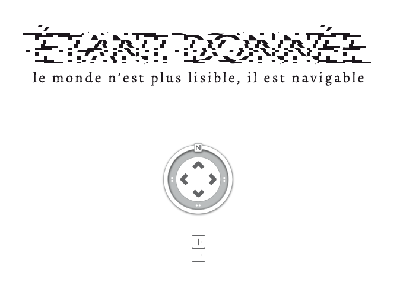
§§§§§§§§§§§§§§§§§§§§§§§§§§§§§§§§§§§§§§§§§§§§§
<!-- .slide: data-background-image="img/fond_noir.jpeg" -->
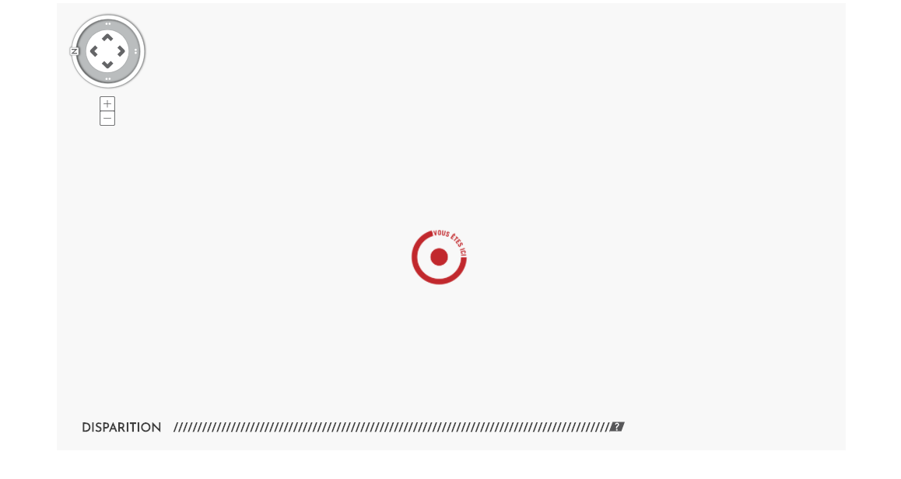
§§§§§§§§§§§§§§§§§§§§§§§§§§§§§§§§§§§§§§§§§§§§§
<!-- .slide: data-background-image="img/fond_noir.jpeg" -->
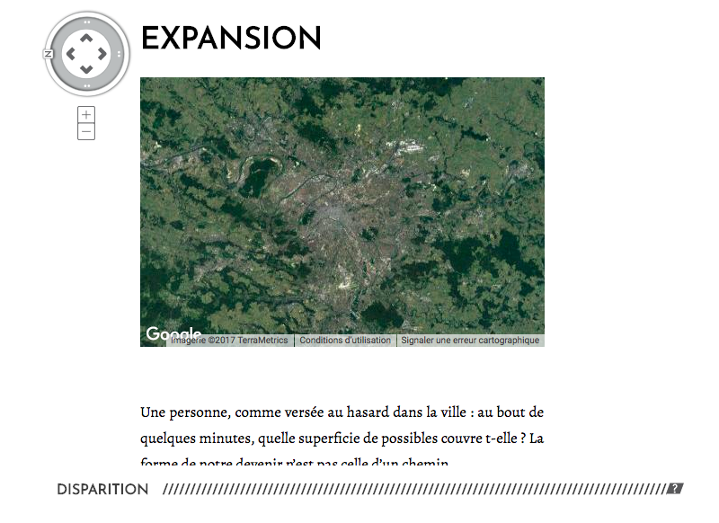
§§§§§§§§§§§§§§§§§§§§§§§§§§§§§§§§§§§§§§§§§§§§§
<!-- .slide: data-background-image="img/fond_noir.jpeg" -->
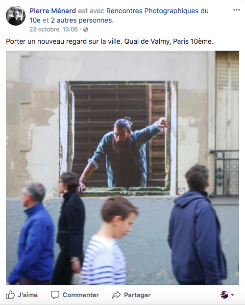
§§§§§§§§§§§§§§§§§§§§§§§§§§§§§§§§§§§§§§§§§§§§§
<!-- .slide: data-background-image="img/fond_noir.jpeg" -->
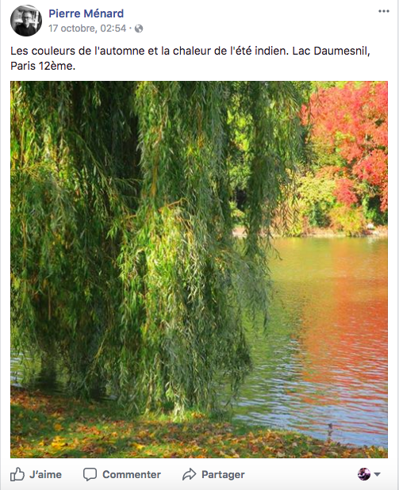
§§§§§§§§§§§§§§§§§§§§§§§§§§§§§§§§§§§§§§§§§§§§§
<!-- .slide: data-background-image="img/fond_noir.jpeg" -->
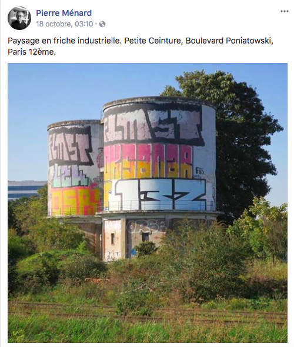
§§§§§§§§§§§§§§§§§§§§§§§§§§§§§§§§§§§§§§§§§§§§§
<!-- .slide: data-background-image="img/fond_noir.jpeg" -->
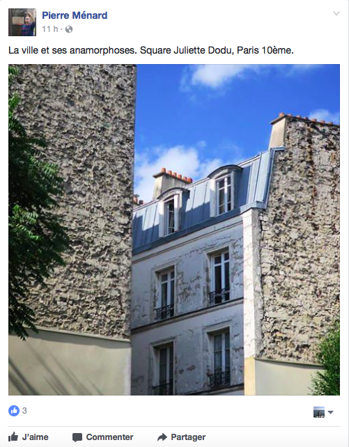
§§§§§§§§§§§§§§§§§§§§§§§§§§§§§§§§§§§§§§§§§§§§§
<!-- .slide: data-background-image="img/fond_noir.jpeg" -->
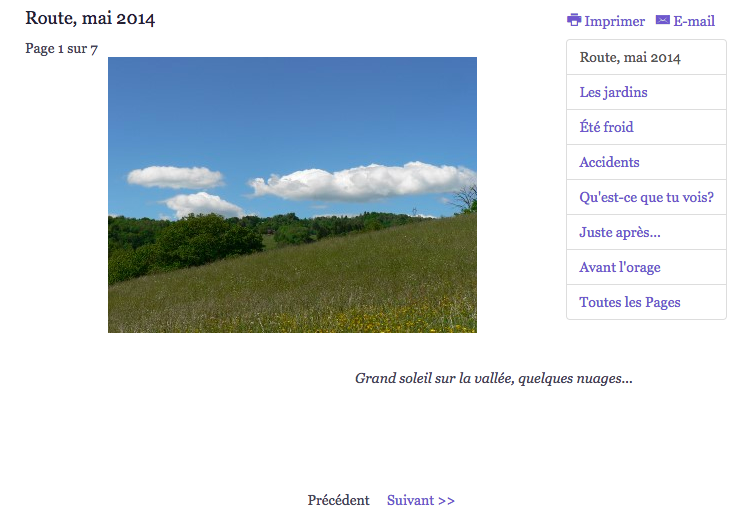
§§§§§§§§§§§§§§§§§§§§§§§§§§§§§§§§§§§§§§§§§§§§§
<!-- .slide: data-background-image="img/fond_noir.jpeg" -->
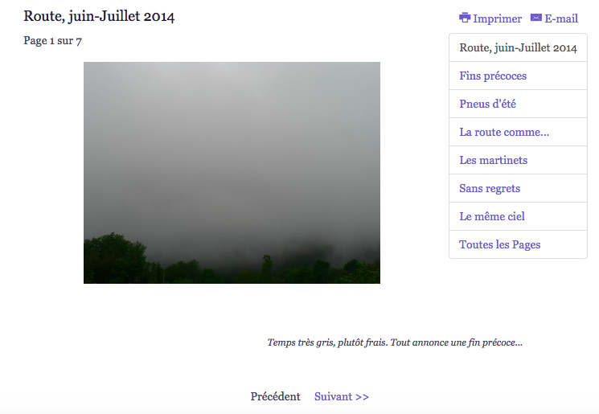
§§§§§§§§§§§§§§§§§§§§§§§§§§§§§§§§§§§§§§§§§§§§§
<!-- .slide: data-background-image="img/fond_noir.jpeg" -->
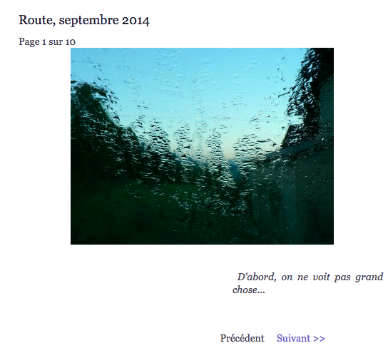
§§§§§§§§§§§§§§§§§§§§§§§§§§§§§§§§§§§§§§§§§§§§§
<!-- .slide: data-background-image="img/fond_noir.jpeg" -->
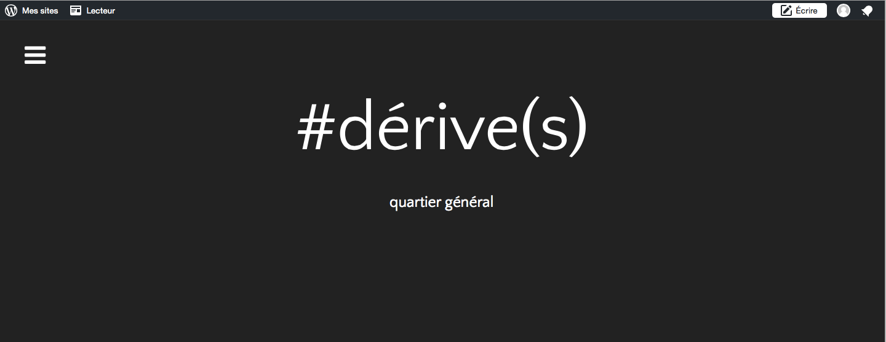
§§§§§§§§§§§§§§§§§§§§§§§§§§§§§§§§§§§§§§§§§§§§§
<!-- .slide: data-background-image="img/fond_noir.jpeg" -->

<ul>
<li>#dérive</li>
<li>#nomDeLieu</li>
</ul>

 

https://storify.com/enagmar88/derives/preview

§§§§§§§§§§§§§§§§§§§§§§§§§§§§§§§§§§§§§§§§§§§§§
<!-- .slide: data-background-image="img/fond_noir.jpeg" -->
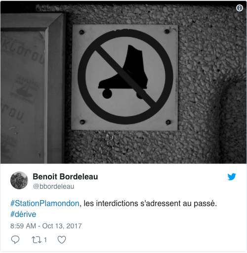
§§§§§§§§§§§§§§§§§§§§§§§§§§§§§§§§§§§§§§§§§§§§§
<!-- .slide: data-background-image="img/fond_noir.jpeg" -->
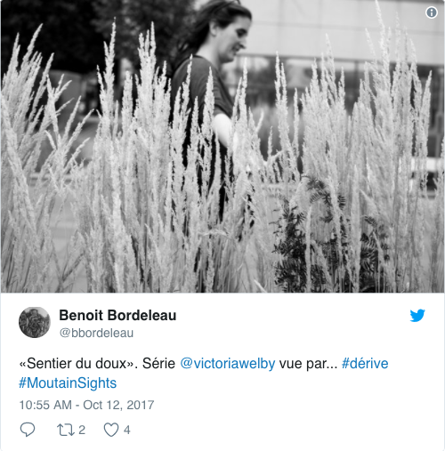
§§§§§§§§§§§§§§§§§§§§§§§§§§§§§§§§§§§§§§§§§§§§§
<!-- .slide: data-background-image="img/fond_noir.jpeg" -->
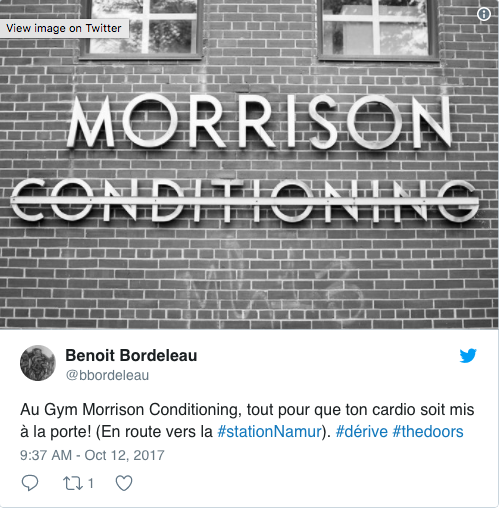
§§§§§§§§§§§§§§§§§§§§§§§§§§§§§§§§§§§§§§§§§§§§§
<!-- .slide: data-background-image="img/fond_noir.jpeg" -->

§§§§§§§§§§§§§§§§§§§§§§§§§§§§§§§§§§§§§§§§§§§§§
<!-- .slide: data-background-image="img/fond_noir.jpeg" -->
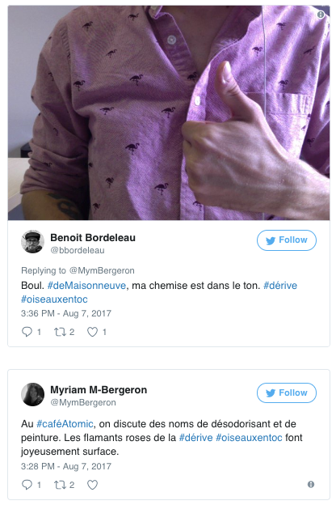
